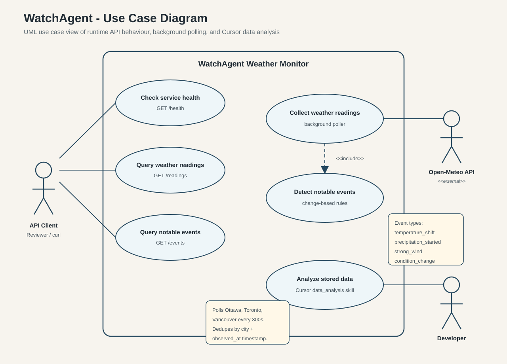
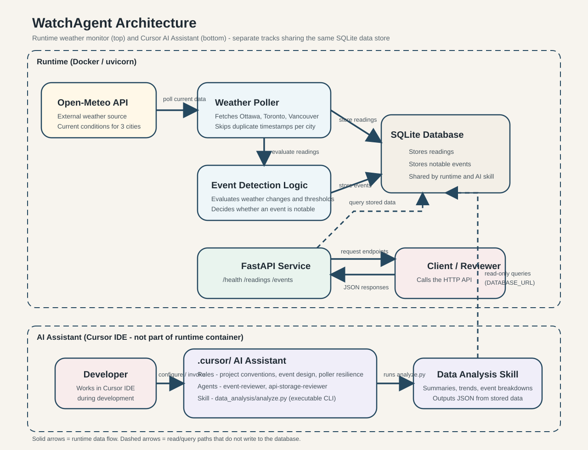
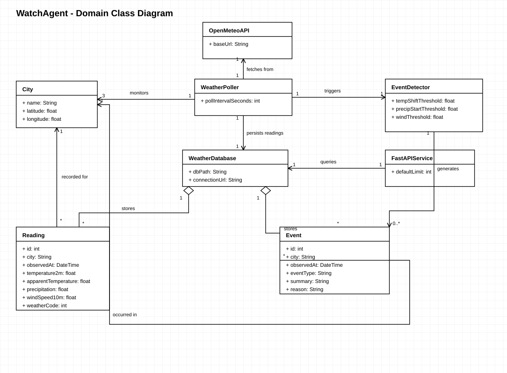
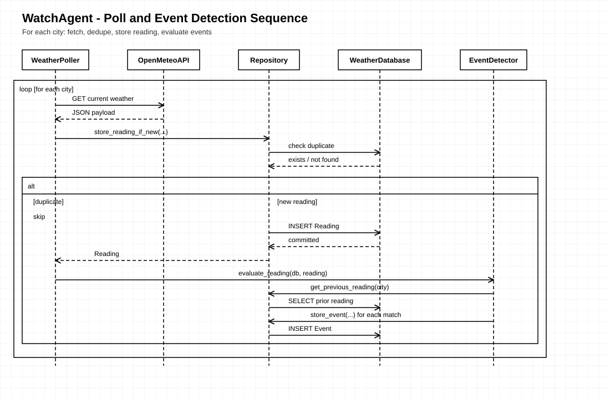

# WatchAgent Weather Monitor

**SENG71000: Systems Analysis and Design — Report Format**

**Nokia Take-Home Project**

**Author:** Johan Tom Chacko

---

## Table of Contents

1. [Introduction](#1-introduction)
2. [Project Overview](#2-project-overview)
3. [Use-Case Analysis](#3-use-case-analysis)
4. [Use-Case Diagram](#4-use-case-diagram)
5. [System Architecture Diagram](#5-system-architecture-diagram)
6. [Domain Model](#6-domain-model)
7. [Class Diagram](#7-class-diagram)
8. [Sequence Diagram](#8-sequence-diagram)
9. [Technology Stack](#9-technology-stack)
10. [Conclusion](#10-conclusion)

---

## 1. Introduction

WatchAgent is a weather monitoring backend that polls Open-Meteo for three Canadian cities, stores readings in SQLite, detects notable weather events using custom change-based rules, and exposes the data through a FastAPI HTTP service. The project also includes a Cursor AI Assistant configuration (rules, agents, and a data-analysis skill) for development and offline analysis of stored data.

This document follows the Systems Analysis and Design report structure used in SENG71000. It describes the functional requirements, use cases, domain model, and design diagrams that support implementation and review of the WatchAgent system.

---

## 2. Project Overview

The system replaces manual or ad-hoc weather checks with an automated pipeline:

1. A background **poller** fetches current conditions from Open-Meteo every 300 seconds (configurable) for Ottawa, Toronto, and Vancouver.
2. New readings are **stored** in SQLite; duplicates are skipped using `(city, observed_at)`.
3. **Event detection** compares each new reading to the previous reading for the same city and stores notable events with what, where, when, and why fields.
4. A **FastAPI service** serves `/health`, `/readings`, and `/events` by querying SQLite only.

There is no frontend. Reviewers run the stack with Docker Compose and call the API directly.

### Monitored cities

| City | Latitude | Longitude |
|---|---|---|
| Ottawa | 45.42 | -75.69 |
| Toronto | 43.70 | -79.42 |
| Vancouver | 49.25 | -123.12 |

### Stored reading fields (Open-Meteo)

Each poll stores five current-condition fields per city:

- `temperature_2m`
- `apparent_temperature`
- `precipitation`
- `wind_speed_10m`
- `weather_code`

---

## 3. Use-Case Analysis

### Collect Weather Readings

| Field | Description |
|---|---|
| **Use Case Name** | Collect Weather Readings |
| **Scenario / Goal** | Fetch and persist current weather for all monitored cities. |
| **Triggering Event** | Poll interval elapses (default 300s) or application startup. |
| **Actors** | Weather Poller, Open-Meteo API, Weather Database |
| **Brief Description** | Calls Open-Meteo for each city, converts timestamps to UTC, and inserts new readings when the `(city, observed_at)` pair is not already stored. |
| **Related Use-Cases** | Detect Notable Events |
| **Stakeholders** | API Client, Developer, Reviewer |
| **Preconditions** | i. Poller enabled (`ENABLE_POLLER=true`) ii. Network access to Open-Meteo iii. Database initialized |
| **Postconditions** | i. New readings stored in SQLite ii. Event detection invoked for each new reading |
| **Flow of activities** | i. Poller: waits for interval ii. Poller: requests current data for Ottawa, Toronto, Vancouver iii. Poller: skips duplicate timestamps iv. Poller: persists new readings v. Poller: triggers event evaluation |
| **Exception Conditions** | i. HTTP fetch failure (logged; poller continues) ii. Unexpected DB error (rollback; poller continues) |

### Detect Notable Events

| Field | Description |
|---|---|
| **Use Case Name** | Detect Notable Events |
| **Scenario / Goal** | Identify meaningful weather changes and store structured event records. |
| **Triggering Event** | A new reading is stored for a city. |
| **Actors** | Event Detector, Weather Database |
| **Brief Description** | Compares the new reading to the previous reading for the same city. Applies change-based rules (temperature shift, precipitation start, strong wind, condition change). Stores events with summary and reason. |
| **Related Use-Cases** | Collect Weather Readings, Query Notable Events |
| **Stakeholders** | API Client, Reviewer |
| **Preconditions** | i. At least one prior reading exists for the city (first reading produces no events) ii. New reading successfully stored |
| **Postconditions** | i. Zero or more events stored ii. Each event answers what, where, when, and why |
| **Flow of activities** | i. Event Detector: loads previous reading ii. Event Detector: evaluates rules iii. Event Detector: stores matching events |
| **Exception Conditions** | i. No previous reading (skip — normal for first poll) ii. DB write failure |

### Query Weather Readings

| Field | Description |
|---|---|
| **Use Case Name** | Query Weather Readings |
| **Scenario / Goal** | Retrieve stored weather readings via HTTP. |
| **Triggering Event** | API client sends `GET /readings`. |
| **Actors** | API Client, FastAPI Service, Weather Database |
| **Brief Description** | Returns readings newest-first, optionally filtered by city, with configurable limit. |
| **Related Use-Cases** | Check Service Health |
| **Stakeholders** | Reviewer, Developer |
| **Preconditions** | i. API service running ii. Database accessible |
| **Postconditions** | JSON response `{ "readings": [ ... ] }` returned |
| **Flow of activities** | i. Client: sends request with optional `city` and `limit` ii. FastAPI: queries SQLite iii. FastAPI: returns serialized readings |
| **Exception Conditions** | i. Invalid `limit` parameter (validation error) ii. Database unavailable |

### Query Notable Events

| Field | Description |
|---|---|
| **Use Case Name** | Query Notable Events |
| **Scenario / Goal** | Retrieve stored notable events via HTTP. |
| **Triggering Event** | API client sends `GET /events`. |
| **Actors** | API Client, FastAPI Service, Weather Database |
| **Brief Description** | Returns events newest-first, optionally filtered by city, with configurable limit. |
| **Related Use-Cases** | Detect Notable Events |
| **Stakeholders** | Reviewer, Developer |
| **Preconditions** | i. API service running ii. Database accessible |
| **Postconditions** | JSON response `{ "events": [ ... ] }` returned |
| **Flow of activities** | i. Client: sends request ii. FastAPI: queries SQLite iii. FastAPI: returns serialized events |
| **Exception Conditions** | i. Invalid query parameters ii. Database unavailable |

### Check Service Health

| Field | Description |
|---|---|
| **Use Case Name** | Check Service Health |
| **Scenario / Goal** | Confirm the service is running and report stored row counts. |
| **Triggering Event** | API client sends `GET /health`. |
| **Actors** | API Client, FastAPI Service, Weather Database |
| **Brief Description** | Returns status and counts of readings and events in the database. |
| **Related Use-Cases** | Query Weather Readings, Query Notable Events |
| **Stakeholders** | Reviewer, CI pipeline |
| **Preconditions** | API service running |
| **Postconditions** | Health JSON returned with counts |
| **Flow of activities** | i. Client: requests `/health` ii. FastAPI: counts rows iii. FastAPI: returns status |
| **Exception Conditions** | Database connection failure |

### Analyze Stored Data

| Field | Description |
|---|---|
| **Use Case Name** | Analyze Stored Data |
| **Scenario / Goal** | Summarize readings and events using the Cursor data-analysis skill. |
| **Triggering Event** | Developer runs `analyze.py` from Cursor or terminal. |
| **Actors** | Developer, Data Analysis Skill, Weather Database |
| **Brief Description** | Read-only CLI queries SQLite for summaries, trends, and event breakdowns. Outputs JSON. |
| **Related Use-Cases** | Query Weather Readings, Query Notable Events |
| **Stakeholders** | Developer |
| **Preconditions** | i. Dependencies installed ii. Database path configured |
| **Postconditions** | JSON analysis printed to stdout |
| **Flow of activities** | i. Developer: invokes skill command ii. Skill: queries SQLite iii. Skill: prints JSON result |
| **Exception Conditions** | i. Missing database file (empty counts returned) ii. Invalid command arguments |

---

## 4. Use-Case Diagram

The diagram shows API Client interactions with health, readings, and events use cases; background polling and event detection inside the system boundary; Developer access to data analysis; and Open-Meteo as an external actor.

Source: [use-case-diagram.puml](use-case-diagram.puml)

---

## 5. System Architecture Diagram

The runtime zone shows Open-Meteo, the poller, event detection, SQLite, and FastAPI. The AI Assistant zone shows Cursor rules, agents, and the data-analysis skill with read-only database access.

---

## 6. Domain Model

The domain includes:

- **City** — monitored location (name, latitude, longitude)
- **Reading** — one observed weather snapshot for a city
- **Event** — one notable change detected between consecutive readings
- **WeatherDatabase** — persistent store for readings and events
- **WeatherPoller** — scheduled fetch and persist process
- **EventDetector** — change-based rule evaluation
- **OpenMeteoAPI** — external weather data source
- **FastAPIService** — HTTP query interface

Relationships:

- WeatherDatabase stores many Readings and many Events (aggregation)
- WeatherPoller monitors three Cities, fetches from OpenMeteoAPI, persists readings, and triggers EventDetector
- EventDetector generates Events
- Reading and Event each belong to a City (via city name)
- FastAPIService queries WeatherDatabase

---

## 7. Class Diagram

The class diagram uses SAD-style notation: hollow diamonds for aggregation, open arrowheads for directed associations, and multiplicity labels on relationships.

Source: [class-diagram.puml](class-diagram.puml)

---

## 8. Sequence Diagram

The following sequence shows the main ingestion path when the poller stores a new reading and event detection runs.

**Narrative:** The poller fetches current weather from Open-Meteo for each city. The repository checks for an existing `(city, observed_at)` row. If the reading is new, it is committed to SQLite. Event detection loads the previous reading, evaluates change-based rules, and stores any generated events. The API path (not shown) is separate: clients query FastAPI, which reads from SQLite without writing.

Source: [sequence-diagram.puml](sequence-diagram.puml)

---

## 9. Technology Stack

| Layer | Technology | Purpose |
|---|---|---|
| Language | Python 3.11 | Application and test code |
| API framework | FastAPI + Uvicorn | REST endpoints and OpenAPI docs |
| ORM | SQLAlchemy 2 | Reading and Event models |
| Database | SQLite | Single-file persistence; Docker volume at `./data/` |
| HTTP client | httpx | Open-Meteo requests in poller |
| Container | Docker + Docker Compose | One-command deployment for reviewers |
| CI | GitHub Actions | `pytest` and `docker build` on push to `main` |
| Testing | pytest (56 tests) | Dedup, events, API, integration, system, analyze skill |
| AI Assistant | Cursor rules, agents, skill | Development guidance and offline data analysis |

---

## 10. Conclusion

The analysis and design work for WatchAgent defines a clear separation between data ingestion (poller + Open-Meteo), persistence (SQLite), event detection (change-based rules), and query access (FastAPI). Use-case analysis captures both runtime API behaviour and background polling. The use-case, architecture, class, and sequence diagrams document static structure and dynamic flow in the same format used in SENG71000 Phase 2 reporting.

Implementation follows this design: modules in `app/` map to the diagram components, and the README provides run instructions, API examples, event-rule justification, and Cursor setup for reviewers.

For operational details (Docker, environment variables, curl examples, CI), see the [project README](../README.md).
